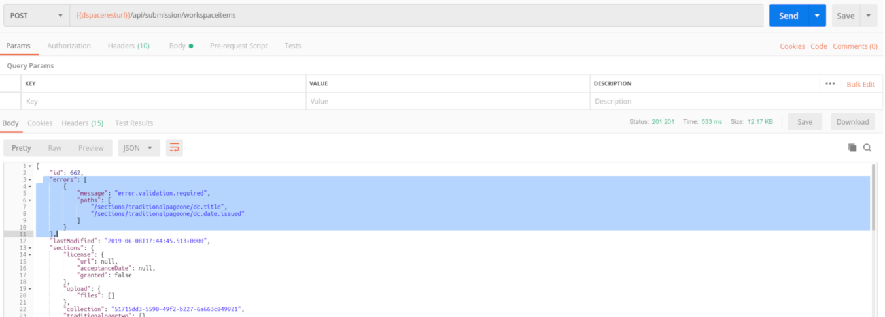


# Exercise 4: Authenticating with Postman

In this exercise, we will note the additional capabilities that are enabled by authenticating as a DSpace user in Postman.  

To illustrate the process, we will step through the authentication process manually.

Use the URL and credentials in the footer of this page.

Note: Postman does provide a mechanism to script authentication.

### 1a. View your authentication status

`api/authn/status`

In the return section, note that authentication is false.

### 1b. Pass credentials to the login restService

Make a POST call to `api/authn/login` without any credentials, in order to get a response with a generated DSPACE-XSRF-TOKEN (see the response's Header).
For POST `api/authn/login' request, modify the Header as follows: Content-Type= application/x-www-form-urlencoded and X-XSRF-TOKEN= DSPACE-XSRF-TOKEN's value (from previous step)
Modify the body as follows(form-urlencoded): user= yourUsername, password= yourPassword 
After modifying the Body and the Header, make a new POST request to `api/authn/login`

Note that the credentials you need to use will differ from the screenshot below.  

### 1c. Copy the Bearer token and add it to the Authentication section in Postman

If all authentication details are correct, you should receive a 200 status code, and in the Header of the response, you will find an 'Authorization' token.
This token is your Bearer token, and should be provided in all future calls as Bearer Token (as authentication method).
In all future cals, also keep in the Header section the X-XSRF-TOKEN provided previously.

### 1d. Re-verify your authentication status 

With the Bearer Token and the X-XSRF-TOKEN, you should be able to get authenticated using

GET `api/authn/status`

In the return section, note that authentication is true.

### Token/Session Duration

As long as you continue to use the tab that contains this Bearer token, you will continue to be authenticated.  If the Bearer token times out, repeat the steps above to generate a new one.

## 2. Viewing Data as an authenticated user

Rerun the queries that you ran in Exercise 2.  Note the result count.  

### 2a. Search for all objects and note the result count

`api/discover/search/objects`

### 2b. Search for "research" and note the result count

`api/discover/search/objects?query=research`

How does this compare to your unauthenticated results?

You can verify this by running the same query in a different tab (without the Bearer token) and note the difference in counts.

### 3. Workspaceitems

It is possible to create and delete objects through Postman.  

In this process, you will perform the underlying tasks that the DSpace Angular client will perform on behalf of a user.

### 3a. Creating a Workspaceitem

Set in the Header: Content-Type= multipart/form-data, X-XSRF-TOKEN= token received at login. Also dont forget to give the Bearer Token for Authenticaation.
The body must be set as multipart and must be empty. Make the call to

POST `api/submission/workspaceitems`

Note the id of the object that is created.

### 3b. Retrieve the workspace item you created

GET `api/submission/workspaceitems/[id]`

Note the error section where missing mandatory metadata and sections are listed
 

### 3c. Delete the workspace item you created

DELETE `api/submission/workspaceitems/[id]`

### 3d. Attempt to retrieve the workspace item you deleted

GET `api/submission/workspaceitems/[id]`



