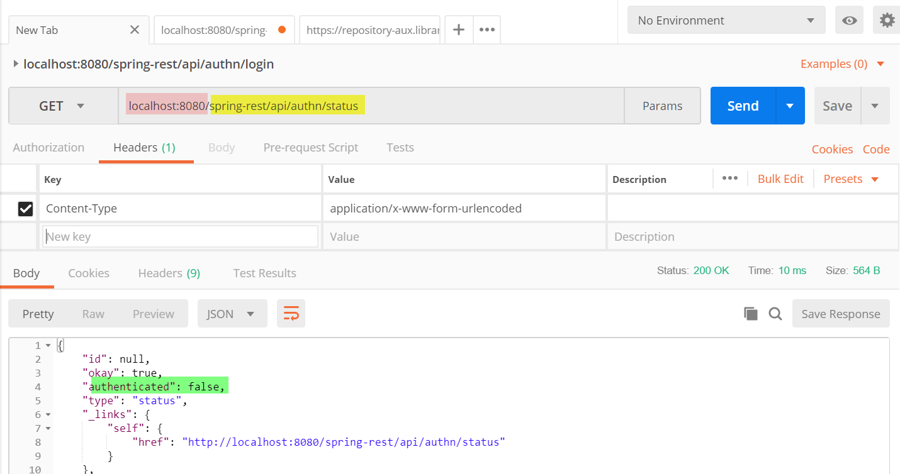
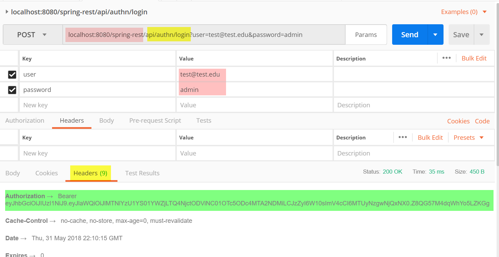
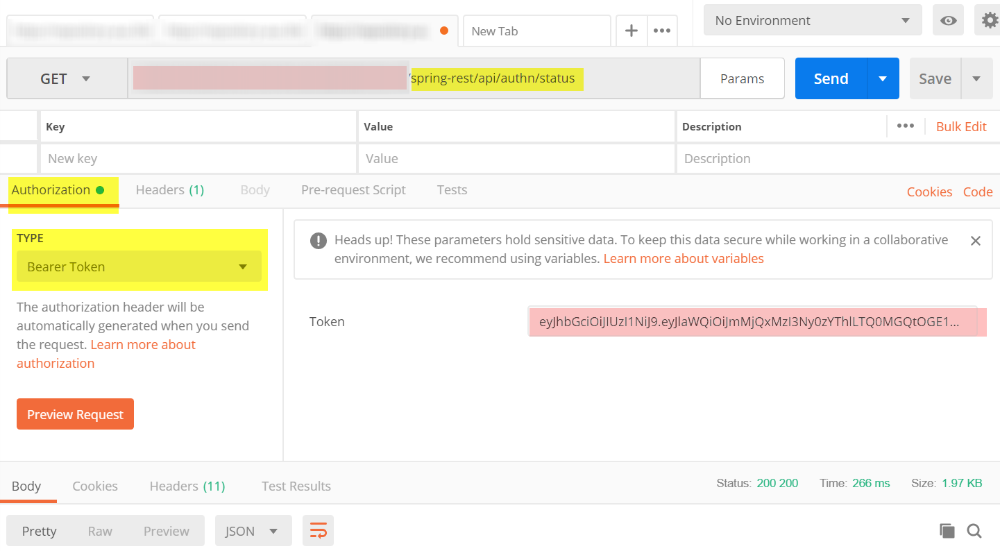
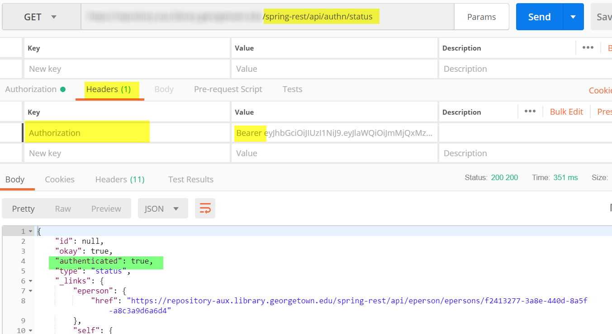

# Exercise 4: Authenticating with Postman

In this exercise, we will note the additional capabilities that are enabled by authenticating as a DSpace user in Postman.  

To illustrate the process, we will step through the authentication process manually.

Use the URL and credentials in the footer of this page.

Note: Postman does provide a mechanism to script authentication.

### 1a. View your authentication status

`api/authn/status`

In the return section, note that authentication is false.

### 1b. Pass credentials to the login restService

Note that the credentials you need to use will differ from the screenshot below.  

Note that the login endpoint should be invoked with the POST method.

POST `api/authn/login`

### 1c. Copy the Bearer token and add it to the Authentication section in Postman

### 1d. Re-verify your authentication status

`api/authn/status`

In the return section, note that authentication is false.

### Token/Session Duration

As long as you continue to use the tab that contains this Bearer token, you will continue to be authenticated.  If the Bearer token times out, repeat the steps above to generate a new one.

## 2. Viewing Data as an authenticated user

Rerun the queries that you ran in Exercise 2.  Note the result count.  

### 2a. Search for all objects and note the result count

`api/discover/search/objects`

### 2b. Search for "research" and note the result count

`api/discover/search/objects?query=research`

How does this compare to your unauthenticated results?

You can verify this by running the same query in a different tab (without the Bearer token) and note the difference in counts.

### 3. Workspaceitems

It is possible to create and delete objects through Postman.  

In this process, you will perform the underlying tasks that the DSpace Angular client will perform on behalf of a user.

### 3a. Creating a Workspaceitem

POST `api/submission/workspaceitems`

This endpoint allows you to post an empty object to the request.

Note the id of the object that is created.

### 3b. Retrieve the workspace item you created

GET `api/submission/workspaceitems/[id]`

### 3c. Retrieve the workspace item you created

DELETE `api/submission/workspaceitems/[id]`

### 3d. Attempt to retrieve the workspace item you deleted

GET `api/submission/workspaceitems/[id]`



